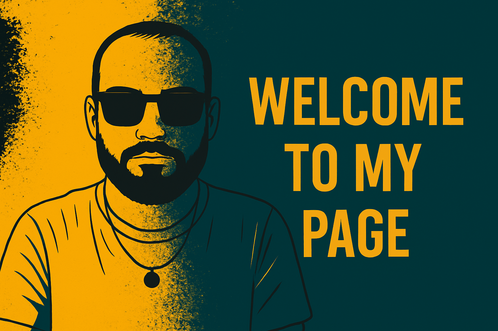
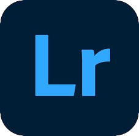
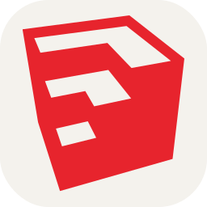
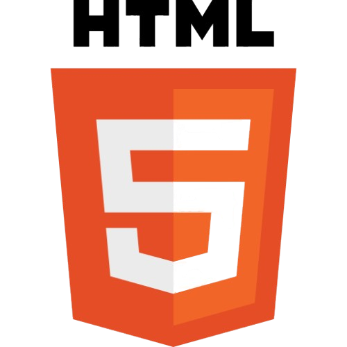

####👋 Welcome to my page JMFDesigner

---

### 🟠 About me

I am a graphic designer and front-end developer with a strong passion for creating visually appealing, functional, and user-centered experiences.  
My approach blends design and technology to bring clean, intuitive, and modern interfaces to life.  
I have experience with tools such as Adobe Creative Suite, Sketch, and Figma, along with strong knowledge of HTML, CSS, and JavaScript.  
This allows me to turn ideas into cohesive visual solutions that not only look great but also perform seamlessly.  
I am always motivated to take on new creative challenges and collaborate with teams that value the balance between aesthetics and functionality, always aiming to deliver high-impact results.

---

<table>
  <tr>
    <td align="center">
      <strong>Design Skills</strong>  
      
      
      
      
      
      
    </td>
    <td align="center">
      <strong>Front-End Developer Skills</strong>  
      
      
      
      
      
    </td>
  </tr>
</table>

---

## 👨‍💻 Mis proyectos de developer

- Proyecto 1 - Descripción  
- Proyecto 2 - Descripción

---

## 🎨 Mis proyectos de diseño gráfico e ilustración

- Proyecto A - Descripción  
- Proyecto B - Descripción

<!--
**JMFDesigner/JMFDesigner** is a ✨ _special_ ✨ repository because its `README.md` (this file) appears on your GitHub profile.

Here are some ideas to get you started:

- 🔭 I’m currently working on ...
- 🌱 I’m currently learning ...
- 👯 I’m looking to collaborate on ...
- 🤔 I’m looking for help with ...
- 💬 Ask me about ...
- 📫 How to reach me: ...
- 😄 Pronouns: ...
- ⚡ Fun fact: ...
-->
